# 🫀 Heart Disease Prediction App

This web app predicts the **likelihood of a person having heart disease** based on medical and lifestyle inputs. Built using **Streamlit**, it provides real-time interaction with a trained **machine learning model**.


## 🚀 Features

- 🔍 Predicts **heart disease risk** with confidence score
- 📊 User-friendly interface with **sliders and radio buttons**
- 🌙 **Dark mode theme** for visual comfort
- 🧠 Displays **risk level** as a percentage and category: `Low`, `Moderate`, or `High`
- 🖼️ Includes custom **logo and styling**
- 💡 Built using `RandomForestClassifier` and `StandardScaler`


## 📦 Technologies Used

- **Python**
- **Streamlit**
- **scikit-learn**
- **pandas**, **numpy**
- **matplotlib**, **seaborn**


## 🛠️ How to Run Locally

```bash
# Clone the repository
git clone https://github.com/RpM-999/P1-Heart-Disease-Predictor.git
cd P1-Heart-Disease-Predictor

# Create a virtual environment 
python -m venv env

# Activate the environment
# On Windows:
env\Scripts\activate
# On Mac/Linux:
source env/bin/activate

# Install dependencies
pip install -r requirements.txt

# Run the Streamlit app
streamlit run Heart_Predictor.py
```


## 📁 Project Structure

```bash
📦 P1-Heart-Disease-Predictor
├── Heart_Predictor.py                # Streamlit web app script
├── Heart_Disease_Predictor.pkl       # Trained ML model
├── scaler.pkl                        # Scaler for input normalization
├── logo.png                          # Custom logo (optional)
├── requirements.txt                  # Python dependencies
├── heart_disease_prediction.ipynb    # Jupyter notebook for model training
├── heart_disease_dataset.csv         # Dataset used for training
```
## 🔄 Project Workflow

```mermaid
flowchart LR
    A[Data Collection]:::green --> 
    B[Data Cleaning]:::blue --> 
    C[Data Preprocessing]:::yellow --> 
    D[Model Training]:::purple --> 
    E[App Development]:::black --> 
    F[Prediction Pipeline]:::brown --> 
    G[Deployment]:::orange

    classDef green fill:#a5d6a7,color:#000,font-weight:bold;
    classDef blue fill:#90caf9,color:#000,font-weight:bold;
    classDef yellow fill:#fff59d,color:#000,font-weight:bold;
    classDef purple fill:#ce93d8,color:#000,font-weight:bold;
    classDef black fill:#cfd8dc,color:#000,font-weight:bold;
    classDef brown fill:#bcaaa4,color:#000,font-weight:bold;
    classDef orange fill:#ffcc80,color:#000,font-weight:bold;
```



## 📊 Dataset
Ensure that heart_disease_dataset.csv is present for training purposes.
If not included, you can:
* 📥 Download from [Kaggle](https://www.kaggle.com/datasets/rashadrmammadov/heart-disease-prediction)

## 🧠 Model Info

| Metric       | Logistic Regression | Random Forest       |
|--------------|---------------------|---------------------|
| Accuracy     | 87%                 | **100%**            |
| Precision    | 88% (class 0), 85% (class 1) | **100% (both classes)** |
| Recall       | 90% (class 0), 83% (class 1) | **100% (both classes)** |
| F1-Score     | 89% (class 0), 84% (class 1) | **100% (both classes)** |

 ✅ **Random Forest** performed better than Logistic Regression in every evaluation metric so it was chosen for deployment.

## 🔗 Live Demo

🌐 [Click here to try the app](https://heart-disease-predictor-999.streamlit.app/)

## 📄 License

This project is licensed under the **MIT License**. See the [LICENSE](LICENSE) file for details.

## 👨‍💻 Developed By

**Rupam Mondal**  

📧 Email: [Mail](rupam.mondal2022@uem.edu.in)  
🔗 [LinkedIn](https://www.linkedin.com/in/rupam-mondal-96551828b )
